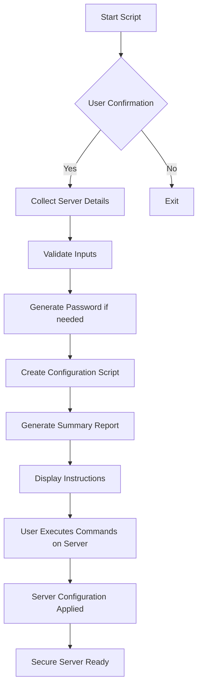

# 🚀 Automated Server Setup Script

### Curl execute
```bash
bash -c "$(curl -fsSL https://raw.githubusercontent.com/ask-sup/fresh_vps_server_config/main/setup-server.sh)"
```
### GIT Clone and execute
```bash
git clone https://github.com/ask-sup/fresh_vps_server_config.git && cd fresh_vps_server_config && chmod +x setup-server.sh && ./setup-server.sh
```
### Windows PowerShell
```powershell
irm https://raw.githubusercontent.com/ask-sup/fresh_vps_server_config/main/setup-server.sh | bash
```


-green.svg)


## 📖 Overview

A powerful interactive bash script for automated provisioning of new Debian/Ubuntu servers with enterprise-grade security settings. The script guides you through the setup process with interactive prompts, generates all necessary configuration commands, and provides a detailed summary with connection instructions.

## 📋 What You'll Need
Server IP or domain name
Root password for your VPS
Your SSH public key
(Optional) Desired username and SSH port

## 🎯 How It Works
Download: Script downloads via curl directly
Interactive Setup: Answer simple questions about your server
Config Generation: Script creates setup files locally
Manual Execution: You run the generated commands on your server
Complete: Your server is fully secured!

## 🌐 Supported Systems
Windows: Git Bash, WSL, PowerShell
Linux: Ubuntu, Debian, CentOS, etc.
macOS: Terminal, iTerm
Any system with curl and bash

## ✨ Features

- 🔐 **Security Hardening**: Disables root SSH access, configures firewall
- 🔑 **Dual Authentication**: Supports both SSH keys and password authentication
- 🛡️ **Brute Force Protection**: Fail2Ban with optimized settings
- 🌐 **Firewall Setup**: UFW configured to allow only specified SSH port
- 📦 **Automatic Updates**: Unattended security updates enabled
- 👤 **User Management**: Creates sudo user with secure password
- 🎨 **Interactive Interface**: Color-coded prompts and status messages
- 📋 **Detailed Reporting**: Generates comprehensive setup summary


### Script Logic Flow

